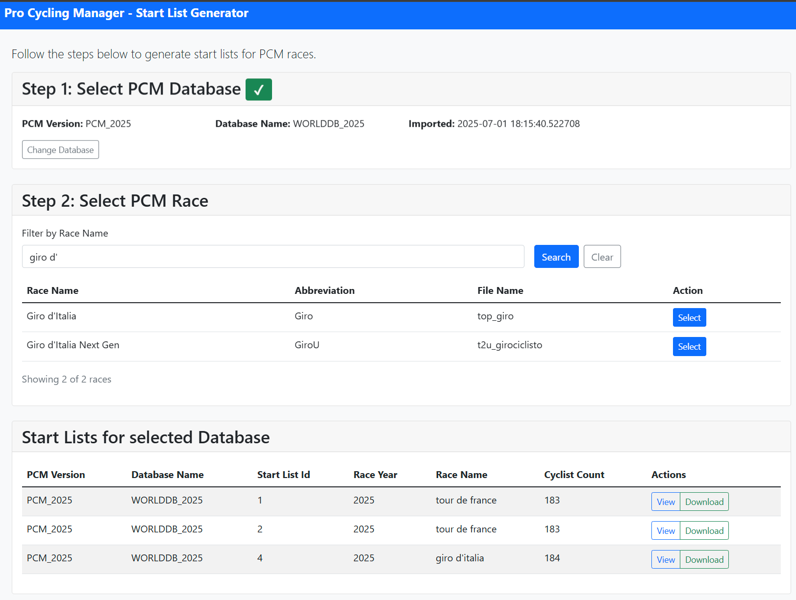

# Start List Generator for Pro Cycling Manager

This project is a Python application designed to generate race start lists for the Pro Cycling Manager video game. It pulls real start list data from the internet and integrates it with the race and rider data from the PCM database (SQLite), creating XML files that the game can utilize.

## Features

1. Download and parse real life start lists
2. Match start list data with PCM database data 
3. Generate PCM-compatible start list XML files



## How it Works

Generating start lists requires three tables from the PCM database:

- Cyclist - matching pcm cyclist id using name
- Team - matching PCM team id using team name
- Race - identify the correct PCM file for the startm list(e.g. `top_giro.xml`)

## Add PCM Database

To add a custom PCM database, first export it to a SQLite file with these steps

1. Download `SQLiteExporter.exe`.
2. Open a command prompt and navigate to the folder containing `SQLiteExporter.exe`.
3. Run the following command to export your `.cdb` file:

```bash
SQLiteExporter.exe -export "Pro Cycling Manager <edition>\Cloud\<your_username>\Career_1.cdb"
```

4. Move the generated `.sqlite` file to the `src/data/pcm_dbs` directory and rename it to match the `pcm_database_name`.

## Prerequisites

1. Clone this repository
2. Install and configured Docker
3. Setup the .env file 
4. Launch the web app with docker-compose

## Running with Docker

1. Quick start with Docker Compose docker-compose up --build
2. Access the web app http://localhost:8080

## Contributing

Contributions are welcome! Please feel free to submit a pull request or open an issue for any suggestions or improvements.

## License

This project is licensed under the MIT License. See the LICENSE file for more details.