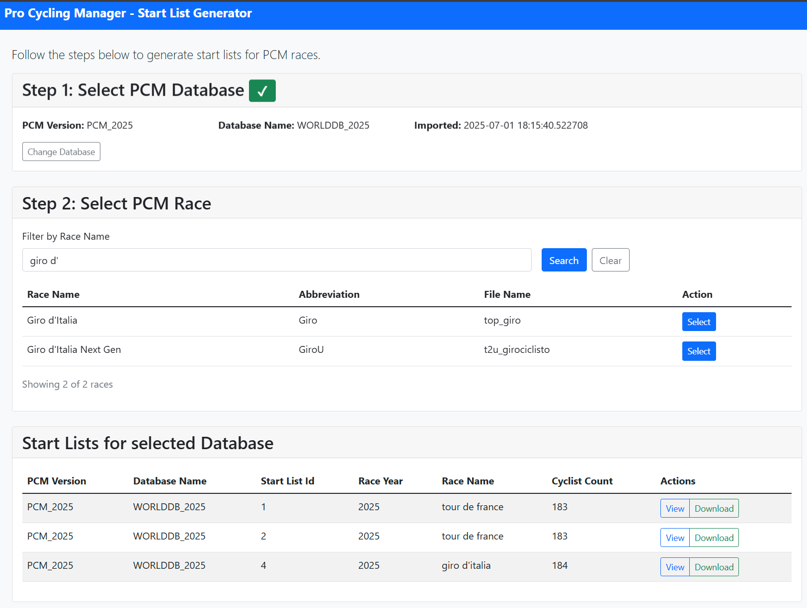

# \*IN BETA\* Start List Generator for Pro Cycling Manager

This project is a Python based web app which generates start lists for the Pro Cycling Manager video game. 

## Features

1. Download and parse real life start lists
2. Import custom PCM databases
3. Match start list data with PCM database data using fuzzy logic
4. Generate PCM-compatible start list XML files

## Running the Web App

This web app can be ran locally using Docker. Any OS (Mac OSX, Windows, Linux) will work but the host hardware must support virtualization.

Requried software
- `git`
- `Docker Desktop`

Configure and Launch the Web App
1. Clone the repository with `git clone git@github.com:benvneal88/pcm_startlist.git`
2. Navigate to the project root folder `pcm_startlist` 
3. Configure the environment file by changing the file `env_template.txt` to `.env`
4. In terminal/command prompt launch the web app using Docker with `docker-compose up --build`
5. Access the Web App with a broswer at `http://localhost:8080`

## Export Custom PCM Database

To add a custom PCM database that isn't already provided by ~~default~~, first export the PCM database to a SQLite file

1. Download `SQLiteExporter.exe`.
2. Open a command prompt and navigate to the folder containing `SQLiteExporter.exe`.
3. Run the following command to export your `.cdb` file (must be a Career database for it to contain all the races):
   1. `SQLiteExporter.exe -export "Pro Cycling Manager <edition>\Cloud\<your_username>\Career_1.cdb"`
4. Rename the the newly generated `Career_1.sqlite` file to a descriptive name of the PCM database and year `WORLDDB_2023.sqlite`
5. The PCM database can be imported using the Web App

## Contributing

Contributions are welcome! Please feel free to submit a pull request or open an issue for any suggestions or improvements.

## License

This project is licensed under the MIT License. See the LICENSE file for more details.